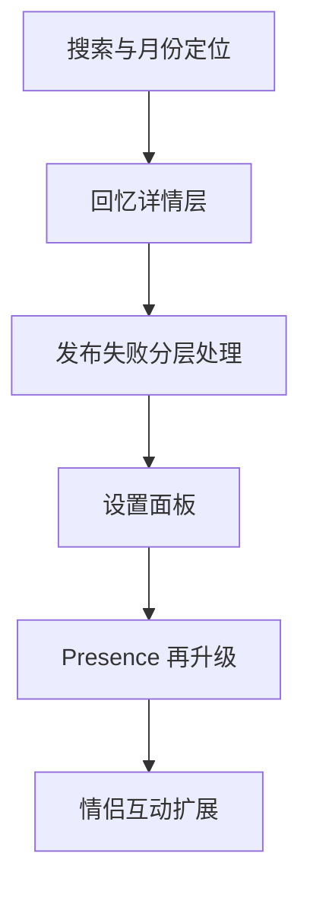

# Us 下一轮可继续改进的方向

## 当前已完成基础项

这一轮已经完成的内容包括：

- 全局 Toast 替换 [`alert`](../../apps/web/src/services/storageService.ts)
- Composer 发布体验增强 [`Composer.tsx`](../../apps/web/src/components/Composer.tsx)
- Header 同步状态点 [`Header.tsx`](../../apps/web/src/components/Header.tsx)
- 空状态中文化与 CTA [`MainPhase.tsx`](../../apps/web/src/components/MainPhase.tsx)
- MemoryCard 全屏 swipe [`MemoryCard.tsx`](../../apps/web/src/components/MemoryCard.tsx)
- 更新公告迁移与整理 [`updateInfo.ts`](../../apps/web/src/config/updateInfo.ts)
- Presence 告别态修复 [`PresenceIndicator.tsx`](../../apps/web/src/components/PresenceIndicator.tsx)

这意味着下一轮不需要再补基础反馈，而应该优先往“更完整的产品能力”和“更细腻的情侣使用体验”推进。

## 最值得继续做的 6 个方向

### 1. 搜索与时间定位

涉及文件：
- [`MainPhase.tsx`](../../apps/web/src/components/MainPhase.tsx)
- [`Header.tsx`](../../apps/web/src/components/Header.tsx)
- [`types.ts`](../../apps/web/src/types.ts)

建议：
- 增加关键词搜索正文
- 增加按月份跳转
- 支持只看“她”/“他”/“全部”
- 后续把已有 [`tags`](../../apps/web/src/types.ts) 真正启用

直接价值：
回忆数量一多，当前应用更像“能翻”，还不够“能找”。这一项会明显提升长期使用价值。

### 2. 回忆详情页 / 沉浸阅读层

涉及文件：
- [`MemoryCard.tsx`](../../apps/web/src/components/MemoryCard.tsx)
- 可新增 `apps/web/src/components/MemoryDetailModal.tsx`

建议：
- 点击卡片正文进入详情层
- 大图浏览、完整日期、作者、更多上下文放进详情层
- 列表卡片保持轻盈，详情层承接“翻旧账”的仪式感

直接价值：
现在的卡片更适合快速浏览，不够适合沉浸回看。这个方向会很符合产品气质。

### 3. 发布失败分层处理

涉及文件：
- [`Composer.tsx`](../../apps/web/src/components/Composer.tsx)
- [`storageService.ts`](../../apps/web/src/services/storageService.ts)

建议：
- 图片上传失败时允许只发文字
- 明确提示哪几张失败
- 成功上传几张、失败几张分开显示
- 失败图片支持重试而不是整次重来

直接价值：
这是当前发布体验里最实用、最容易被真实用户感知的一步补强。

### 4. 设置面板

涉及文件：
- [`Header.tsx`](../../apps/web/src/components/Header.tsx)
- [`AppContext.tsx`](../../apps/web/src/context/AppContext.tsx)
- 可新增 `apps/web/src/components/SettingsModal.tsx`

建议：
- 音效开关
- 动画强度开关
- 图片预加载开关
- 清理本地缓存入口
- 当前同步模式说明

直接价值：
现在功能越来越丰富，但用户对“声音太多”“动画太重”“缓存怎么清”还没有控制权。

### 5. 情侣互动功能补位

建议优先做轻量版本：
- 今日想念一下
- 回忆盲盒
- 纪念日卡片
- 共同愿望清单

直接价值：
把产品从“记忆记录工具”继续拉向“情侣共享空间”。这是最能拉开气质差异的一类能力。

### 6. Presence 再升级为可感知互动

涉及文件：
- [`PresenceIndicator.tsx`](../../apps/web/src/components/PresenceIndicator.tsx)
- [`presenceService.ts`](../../apps/web/src/services/presenceService.ts)

建议：
- 显示“刚刚上线”与“停留中”两个层级
- 支持更轻的常驻状态，而不是只靠浮层
- 可增加“对方正在浏览哪一侧时间轴”这类弱 Presence 信息
- 避免频繁打扰，把强提示和弱提示分层

直接价值：
Presence 已经有氛围，但还不够“有陪伴感”。这一项会让在线状态更像互动，而不只是通知。

## 我建议的下一批优先级

### 第一梯队

1. 搜索与月份定位
2. 发布失败分层处理
3. 回忆详情页

### 第二梯队

4. 设置面板
5. Presence 常驻弱提示

### 第三梯队

6. 互动功能扩展

## 更适合立刻开做的一组任务

## 建议拆成的执行 todo

- 为时间轴增加关键词搜索与月份跳转入口
- 为 MemoryCard 增加详情弹层设计与交互入口
- 为 Composer 增加图片部分失败时的兜底保存与重试反馈
- 增加设置面板并接入音效、动画、缓存控制
- 将 Presence 拆成强提醒与弱提醒两层状态
- 设计第一批情侣互动功能的最小版本
