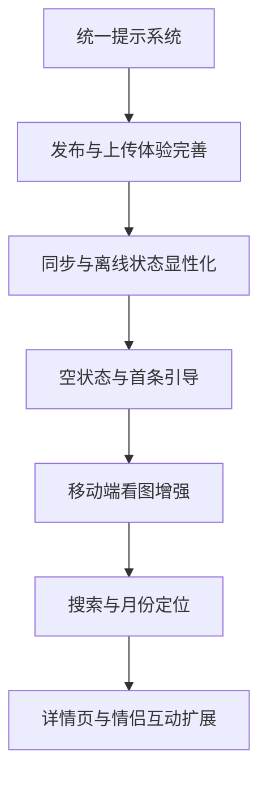

# Us 项目体验与功能完善计划

## 分析范围

本次重点从用户体验与产品功能角度分析，参考文件包括：

- [`README.md`](../../README.md)
- [`package.json`](../../package.json)
- [`apps/web/src/App.tsx`](../../apps/web/src/App.tsx)
- [`apps/web/src/context/AppContext.tsx`](../../apps/web/src/context/AppContext.tsx)
- [`apps/web/src/components/LoginPhase.tsx`](../../apps/web/src/components/LoginPhase.tsx)
- [`apps/web/src/components/Header.tsx`](../../apps/web/src/components/Header.tsx)
- [`apps/web/src/components/MainPhase.tsx`](../../apps/web/src/components/MainPhase.tsx)
- [`apps/web/src/components/Composer.tsx`](../../apps/web/src/components/Composer.tsx)
- [`apps/web/src/components/MemoryCard.tsx`](../../apps/web/src/components/MemoryCard.tsx)
- [`apps/web/src/components/LazyImage.tsx`](../../apps/web/src/components/LazyImage.tsx)
- [`apps/web/src/services/storageService.ts`](../../apps/web/src/services/storageService.ts)
- [`apps/web/src/services/cacheService.ts`](../../apps/web/src/services/cacheService.ts)
- [`apps/web/src/services/presenceService.ts`](../../apps/web/src/services/presenceService.ts)

## 当前产品状态概览

项目已经具备较完整的情侣共享记忆日记体验：登录选人、双栏时间轴、多图上传、编辑删除、暗色模式、PWA、缓存、Realtime、Presence、彩蛋、声音反馈与移动端适配。整体审美方向明确，优势在于氛围感、动画细节、情绪化反馈和情侣场景专属设计。

但当前仍有一些可直接优化的体验缺口：

1. 创建和编辑入口的反馈还不够完整。
2. 图片上传流程缺少批量限制、进度、失败分层提示。
3. 空状态、离线状态、同步状态尚未显性表达。
4. 长列表浏览、回忆查找、日期定位能力不足。
5. 一些高级彩蛋和隐藏操作可发现性偏弱。
6. 弹窗、全屏图、按钮等交互的移动端可访问性可以继续打磨。

## 高优先级优化清单

### 1. 让发布回忆流程更明确

涉及文件：[`Composer.tsx`](../../apps/web/src/components/Composer.tsx)、[`App.tsx`](../../apps/web/src/App.tsx)、[`storageService.ts`](../../apps/web/src/services/storageService.ts)

建议改进：

- 在编辑器底部显示当前已选图片数量，例如 `3 / 9`。
- 创建时也限制最多 9 张，目前编辑时有限制，创建时未显式限制。
- 发布按钮旁显示上传阶段：`准备照片`、`上传第 2 张`、`保存回忆`、`完成`。
- 图片上传失败时允许继续保存文字，并明确提示哪些图片失败。
- 发布成功后可显示一条温柔 toast，而不是只依赖印章动画。

直接收益：减少用户不确定感，避免一次选太多图片导致体验失控。

### 2. 增加全局 Toast 或温柔提示系统

涉及文件：[`AppContext.tsx`](../../apps/web/src/context/AppContext.tsx)、[`App.tsx`](../../apps/web/src/App.tsx)、新增 `apps/web/src/components/ToastHost.tsx` 可选

建议改进：

- 统一替代部分 `alert`，如保存失败、删除失败、图片过大、更新失败。
- 支持类型：成功、失败、提示、同步中。
- 视觉保持轻盈：圆角玻璃卡片、小爱心或星星图标、短暂浮现。
- 保留极少数危险确认仍使用 `confirm` 或改成自定义确认弹窗。

直接收益：降低浏览器原生弹窗的割裂感，提升整体精致度。

### 3. 显性展示同步与离线状态

涉及文件：[`storageService.ts`](../../apps/web/src/services/storageService.ts)、[`cacheService.ts`](../../apps/web/src/services/cacheService.ts)、[`Header.tsx`](../../apps/web/src/components/Header.tsx)

建议改进：

- Header 增加一个小型状态点：`已同步`、`正在同步`、`离线浏览`、`云端不可用`。
- 使用当前缓存和后台同步状态驱动 UI。
- 当 Supabase 未配置或失败回退到 LocalStorage 时，显示柔和提示，避免用户误以为已经云同步。
- 长按头像刷新完成后显示 `缓存已刷新`，而不只是震动和重载。

直接收益：增强数据可靠性的感知，减少“我的记录到底有没有保存”的焦虑。

### 4. 优化空状态与首条记忆引导

涉及文件：[`MainPhase.tsx`](../../apps/web/src/components/MainPhase.tsx)、[`Composer.tsx`](../../apps/web/src/components/Composer.tsx)

建议改进：

- 替换 `Waiting for her story...` / `Waiting for his story...` 为更产品化的中文引导。
- 空状态中放一个轻量 CTA：`写下第一条属于她的回忆`、`记录今天的小心动`。
- 对当前用户所在侧，CTA 可直接打开 Composer。
- 对对方侧，提示 `等 TA 写下新的小片段`。

直接收益：让新用户更容易开始，而不是面对空白时间轴。

### 5. 强化移动端图片查看体验

涉及文件：[`MemoryCard.tsx`](../../apps/web/src/components/MemoryCard.tsx)、[`LazyImage.tsx`](../../apps/web/src/components/LazyImage.tsx)

建议改进：

- 全屏看图增加左右滑动切换，不只依赖按钮。
- 全屏图底部加入缩略图或当前图片标题区域。
- 下载按钮在移动端可见性更高，不只依赖 hover。
- 图片主图点击行为区分：单击预览、双击放大或通过明显按钮进入全屏。

直接收益：移动端看图更自然，避免 hover 交互在手机上不可见。

## 中优先级优化清单

### 6. 增加回忆筛选和快速定位

涉及文件：[`MainPhase.tsx`](../../apps/web/src/components/MainPhase.tsx)、[`Header.tsx`](../../apps/web/src/components/Header.tsx)、[`types.ts`](../../apps/web/src/types.ts)

建议改进：

- Header 或时间轴顶部增加轻量搜索入口。
- 支持按关键词搜索正文。
- 支持按月份归档或快速跳转到某年某月。
- 后续可启用已有 `tags` 字段，做标签筛选。

直接收益：回忆数量变多后仍能找得到，不只是漂亮地浏览。

### 7. 增加“回忆详情”层级

涉及文件：[`MemoryCard.tsx`](../../apps/web/src/components/MemoryCard.tsx)

建议改进：

- 点击卡片可进入详情浮层。
- 详情页展示更大的正文、更完整的图片浏览、创建日期、作者、可选标签。
- 列表卡片保持轻量，详情承载沉浸阅读。

直接收益：提升长期记录后的阅读仪式感。

### 8. 改进隐藏彩蛋的可发现性

涉及文件：[`Composer.tsx`](../../apps/web/src/components/Composer.tsx)、[`Header.tsx`](../../apps/web/src/components/Header.tsx)、[`App.tsx`](../../apps/web/src/App.tsx)

建议改进：

- 在更新公告或星星公告里放“悄悄话提示”。
- Composer 输入特殊数字时可出现微妙的预提示，而不是发送后直接触发。
- 长按头像清缓存可增加小提示：长按时显示进度环和说明。

直接收益：保留惊喜感，同时降低功能被完全发现不了的问题。

### 9. 丰富情侣互动功能

建议新增方向：

- `今日想念`：每天一次轻互动，记录是否想对方。
- `纪念日小卡片`：到特殊日子可生成一张可保存的纪念图。
- `愿望清单`：情侣共同维护想一起做的事情。
- `回忆盲盒`：随机打开一条过去的回忆。
- `心情天气`：每条记忆可选当天心情 emoji。

直接收益：从“记录工具”进一步变成“情侣互动空间”。

## 低优先级优化清单

### 10. 登录页增加“上次身份”快捷进入

涉及文件：[`LoginPhase.tsx`](../../apps/web/src/components/LoginPhase.tsx)、[`AppContext.tsx`](../../apps/web/src/context/AppContext.tsx)

建议改进：

- 记住上次选择的身份。
- 登录页默认突出上次身份，支持一键进入。
- 仍保留切换身份入口。

直接收益：减少每天打开应用的操作步骤。

### 11. 更新公告从代码常量转为可配置内容

涉及文件：[`types.ts`](../../apps/web/src/types.ts)、[`App.tsx`](../../apps/web/src/App.tsx)

建议改进：

- 当前 `APP_UPDATE` 写在 `types.ts`，长期看不利于内容维护。
- 可迁移到 `apps/web/src/config/updateInfo.ts`。
- 后续可按版本只展示一次。

直接收益：内容维护更自然，也减少类型文件职责混杂。

### 12. 增加设置面板

建议包含：

- 音效开关。
- 动画强度。
- 图片预加载开关。
- 清除本地缓存入口。
- 当前数据模式：云端同步或本地模式。

直接收益：让用户可控制体验强度，尤其适合移动端和低性能设备。

## 推荐执行顺序

## 建议第一轮直接实施的任务

1. 新增统一 Toast 组件和上下文能力。
2. 将 `alert` 类提示逐步替换为 Toast。
3. Composer 创建时限制最多 9 张图，并显示 `已选 N / 9`。
4. Composer 上传时显示分阶段状态。
5. MainPhase 空状态改为中文情绪化引导，并支持当前用户侧一键打开 Composer。
6. Header 增加轻量同步状态入口，先接入可确定的本地模式和在线状态提示。
7. MemoryCard 全屏图片增加移动端左右滑动切换。

## 验收关注点

- 不破坏现有缓存优先和离线兜底逻辑。
- 不降低当前浪漫、轻盈、柔和的产品气质。
- 移动端 hover 不可达的按钮要有替代入口。
- 原生 `alert` 逐步减少，但危险操作仍要有明确确认。
- 图片上传失败时不要吞掉错误，也不要让用户误以为已完整保存。
