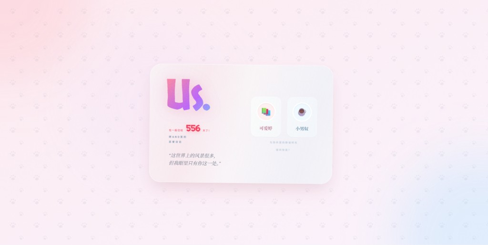
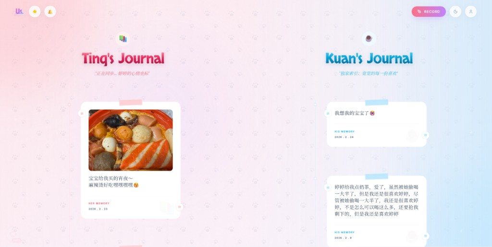
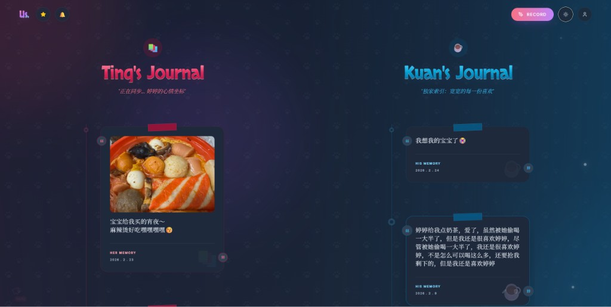
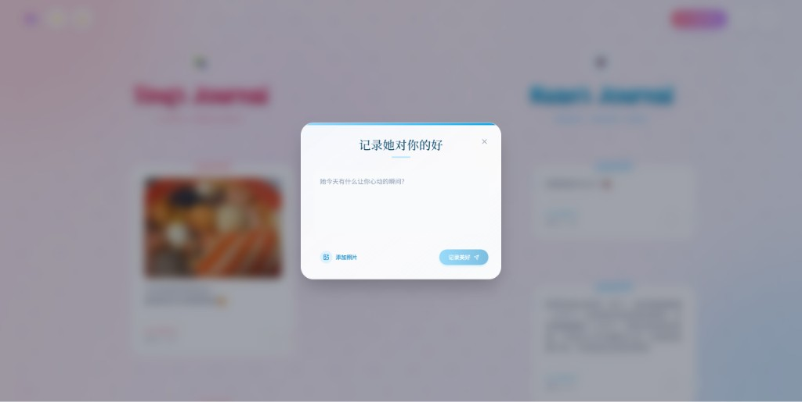

# Us - A Shared Memory Journal (我们的故事)

> **GitHub Repository**: [https://github.com/lin-hongkuan/us](https://github.com/lin-hongkuan/us)


**Us** 是一个专为情侣设计的共享回忆日记应用。它提供了一个温馨、私密的空间，让"她"和"他"可以分别记录各自视角的点点滴滴，共同编织属于两个人的美好回忆。

支持 **PWA** 安装到桌面 / 手机主屏幕，也支持通过 **Capacitor** 构建为原生 Android APK。

### 预览 (Preview)

**登录页** — 身份选择 · 恋爱天数 · 情话轮播 · 动态头像



**主页 (浅色模式)** — 双栏时间轴 · 记忆卡片 · 多图展示



**主页 (深色模式)** — 全局暗色主题 · 渐变边框 · 发光效果



**编辑器** — 新建回忆 · 多图上传 · 背景模糊



## ✨ 特性 (Features)

### 📱 多平台支持
- **PWA**：可安装到手机主屏幕或电脑桌面，隐藏浏览器地址栏，全屏沉浸体验。
- **Android APK**：通过 Capacitor 构建原生 Android 应用，提供项目内 `scripts/` 构建脚本。
- **离线访问**：Service Worker 预缓存静态资源，Supabase API 和图片均有运行时缓存策略。

### 🎨 沉浸式视觉体验
- **双色调主题**：
  - 💗 **Her Side**：温暖的玫瑰粉色调，象征温柔与细腻。
  - 💙 **His Side**：清新的天空蓝色调，象征宽广与包容。
  - 桌面端采用分屏融合渐变，移动端切换标签或左右滑动。
- **深色模式**：跟随系统偏好或手动切换，全局一键暗色主题。
- **动态流光背景**：
  - 背景色彩随时间流动（`animate-gradient`），三个色团做 blob 缓动。
  - **交互式光影（Desktop）**：鼠标移动时背景色团以阻尼动画缓慢跟随，营造呼吸般的沉浸感。
  - 点击屏幕任意位置（含登录页）迸发可爱的小星星（`ClickStarOverlay`）。
  - 猫爪脚印图案在背景缓慢游走。
- **精致排版**：
  - 标题 **Skranji** 字体，正文 **Playfair Display** / **Inter**。
  - 纹理文字效果（渐变 + 噪点 + 悬浮阴影）。
- **首屏骨架屏**：React 加载前显示爱心跳动动画，深色模式无闪烁。
- **移动端性能优化**：自动降级 backdrop-blur、禁用 blob 动画、减少星星数量。

### 💝 核心功能
- **双视角记录**：以"她"或"他"的身份发布回忆，桌面端左右分栏同时展示。
- **多图上传**：每条回忆最多 9 张照片，支持缩略图列表、主图展开/收起、全屏看图（左右切换）、下载。
  - Supabase Storage 上传原图（无压缩），Base64 兜底。
  - `LazyImage` 组件统一懒加载：IntersectionObserver 视口检测、骨架屏 shimmer、fallback 回退、指数退避重试。
  - 支持 Supabase Storage render API 生成缩略图 URL。
- **回忆管理**：支持编辑文字、增删图片、删除整条回忆。仅作者可操作。
- **时间轴展示**：按时间倒序排列，桌面端带左侧时间线圆点装饰。

### ⚡ 三层缓存 + 实时同步
- **Cache-First 加载**：内存缓存（毫秒级）→ IndexedDB（10ms 级）→ Supabase 云端。首次访问后再次打开瞬间加载。
- **后台静默同步**：加载缓存后，后台自动与云端对比并增量更新，带 AbortController 超时控制和最小间隔节流。
- **Supabase Realtime 订阅**：监听 INSERT / UPDATE / DELETE，对方发布回忆时自动出现在你的列表中。

### 👫 双人在线状态 (Presence)
- 基于 Supabase Realtime Presence，检测双方是否同时在线。
- **上线时**：屏幕中心爆发爱心粒子 + 光波扩散 + 渐变旋转边框卡片 + 提示音。
- **在线中**：底部悬浮卡片显示双头像（心跳爱心连线）、甜蜜文案、微粒子上浮动效。
- **下线时**：温柔的告别文案，卡片自动 3.5s 后消失。
- 支持指数退避重连（最多 5 次）、心跳保活、页面可见性恢复 track。

### 🔊 声音反馈
- 基于 Web Audio API，无外部音频文件。
- 不同操作对应不同音效：Her 高频上扬、Him 低频下沉、通用点击、印章盖章、刷新加载渐进、加载完成双音阶、成功三连音。

### 🎮 彩蛋与趣味
- **重力模式**：在编辑器中输入 `1104` 发送，所有记忆卡片变成 Matter.js 物理刚体，在重力下坠落弹跳，可拖拽交互。
- **2048 Emoji**：在编辑器中输入 `2005` 发送，打开动物表情版 2048 滑动拼图游戏。
- **恋爱存钱罐 (PiggyBank)**：记忆数量作为"爱心金币"，达到目标（默认 52）弹出万能兑换券奖励。
- **「你今天想我了吗？」对话框**：点击星星公告按钮触发，可爱的交互问答。
- **特殊日期检测**：恋爱天数整百（100、200…520）或纪念日当天显示专属庆祝动画。
- **深夜模式**：凌晨 1-6 点访问时顶栏出现猫头鹰按钮，温馨提醒注意休息。

### 🐾 登录页
- 大号 "Us." 纹理 Logo，带呼吸缩放动画。
- 恋爱天数滚动计数（缓出动画）。
- 30+ 条恋爱情话轮播（点击切换，第二行延迟显示）。
- 32 组动态头像对偶，每 10 分钟自动轮换，附带小寓意。
- 卡片浮动、光带扫过、噪点呼吸纹理。

### 🧩 组件架构（重构后）
应用按阶段拆分为独立组件，核心视图懒加载：

| 阶段 / 功能 | 组件 | 说明 |
|---|---|---|
| 登录选人 | `LoginPhase` | 身份选择页 |
| 过渡加载 | `TransitionPhase` | 环形进度条 + 头像 + 背景渐入渐出 |
| 顶栏 | `Header` | 品牌标题、标签切换、记录按钮、深色模式、退出 |
| 主内容 | `MainPhase` | 双栏记忆列表、滑动切换、滚动隐藏 Header、长按刷新缓存 |
| 记忆卡片 | `MemoryCard` | 正文/多图展示、编辑、删除、全屏看图，React.memo 优化 |
| 编辑器 | `Composer` (lazy) | 新建回忆模态框，支持多图上传 |
| 图片 | `LazyImage` | 统一懒加载、骨架屏、fallback、重试 |
| 在线状态 | `PresenceIndicator` | 双人 Presence 卡片 + 爆发粒子 |
| 打字机 | `TypewriterText` | 逐字打字效果 |
| 星星特效 | `ClickStarOverlay` | 全局点击星星，CustomEvent 驱动 |
| 存钱罐 | `PiggyBank` (lazy) | 游戏化计数器 |
| 重力模式 | `GravityMode` (lazy) | Matter.js 物理彩蛋 |
| 2048 | `Game2048` (lazy) | 动物表情 2048 游戏彩蛋 |

### 📦 全局状态 (Context)
`AppContext` 管理：
- 当前用户（`currentUser`）
- 深色模式（`darkMode`，自动持久化到 localStorage）
- 全局音效（`playClickSound` / `playRefreshSound` / `playLoadCompleteSound` / `playSuccessSound`）
- 全局 `mousedown` 监听，任何带 `data-sound` 属性的元素点击自动发声

## 🛠️ 技术栈 (Tech Stack)

| 类别 | 技术 |
|---|---|
| **前端框架** | [React 19](https://react.dev/) |
| **构建工具** | [Vite 6](https://vitejs.dev/) + esbuild 压缩 + 手动 chunk 分包 |
| **PWA** | [vite-plugin-pwa](https://vite-pwa-org.netlify.app/)（Workbox 运行时缓存策略） |
| **样式** | [Tailwind CSS 3.4](https://tailwindcss.com/) + 自定义 CSS 动画 |
| **字体** | Google Fonts（Skranji · Playfair Display · Inter） |
| **后端/存储** | [Supabase](https://supabase.com/)（PostgreSQL + Storage + Realtime） |
| **缓存** | 三层：内存 → IndexedDB → Supabase 云端 |
| **物理引擎** | [Matter.js](https://brm.io/matter-js/) |
| **日期处理** | [date-fns](https://date-fns.org/) |
| **图标** | [Lucide React](https://lucide.dev/) |
| **原生打包** | [Capacitor](https://capacitorjs.com/)（Android） |

## 🚀 快速开始 (Getting Started)

### 1. 克隆项目
```bash
git clone https://github.com/lin-hongkuan/us.git
cd us
```

### 2. 安装依赖
```bash
npm install
```

### 3. 启动开发服务器
```bash
npm run dev
```
访问 `http://localhost:3000` 即可预览（含 PWA 开发模式）。

### 4. 构建生产版本
```bash
npm run build
npm run preview   # 本地预览构建产物
```

### 5. 构建 Android APK（可选）
```bash
# Windows PowerShell
.\scripts\build-android.ps1

# 或 CMD
scripts\build-android.bat
```
需要先安装 Android Studio 并配置 Capacitor。详见 `capacitor.config.ts`。

## 📲 PWA 安装指南

### iOS (Safari)
1. 在 Safari 中打开网站。
2. 点击底部的"分享"按钮。
3. 向下滑动并选择"添加到主屏幕"。

### Android (Chrome)
1. 在 Chrome 中打开网站。
2. 点击右上角菜单（三个点）。
3. 选择"安装应用"或"添加到主屏幕"。

### Desktop (Chrome/Edge)
1. 在浏览器地址栏右侧点击"安装"图标。
2. 确认安装后，应用将以独立窗口运行。

## 📖 使用教程 (User Guide)

### 首次使用

1. **选择身份**：进入登录页，点击 💗 **可爱婷** 或 💙 **小男奴** 选择身份。
2. 观看过渡动画（环形进度 + 头像），数据加载完成后进入主界面。

### 创建回忆

1. 点击右上角渐变色 ✏️ **Record** 按钮打开编辑器。
2. 输入文字内容。
3. **添加照片**（可选）：点击"添加照片"按钮，选择图片（每张最大 50MB，最多 9 张）。
4. 点击 **记录美好** 按钮保存，出现印章盖章动画。

### 管理回忆

- **编辑**：悬浮卡片出现 ✏️ 按钮，点击进入编辑模式，可修改文字、增删图片。
- **删除**：悬浮卡片出现 🗑️ 按钮，确认后删除。
- **查看照片**：点击图片展开/收起；点击右上角全屏按钮查看原图，多张时左右切换。
- **下载照片**：悬浮图片右下角出现 ⬇️ 下载按钮。

### 切换视角

- **桌面端**：左栏"她的日记"，右栏"他的日记"，鼠标进入一侧时背景色调缓慢过渡。
- **移动端**：顶部标签切换或左右滑动。

### 隐藏彩蛋

- 编辑器输入 `1104` 发送 → 重力模式（物理卡片坠落）
- 编辑器输入 `2005` 发送 → 2048 Emoji 游戏
- 长按页面顶部头像 3 秒 → 清除本地缓存并强制刷新

### 权限说明

- 每个人只能编辑和删除自己发布的回忆。
- 可以查看对方发布的所有回忆。
- 双方同时在线时右下角出现甜蜜提示卡片。

## 💾 数据存储说明

### Supabase 云端存储（推荐）
- 数据云端保存，可跨设备访问。
- 三层缓存策略保证加载速度。
- Supabase Realtime 实时同步。
- Storage 存储原图，支持 render API 生成缩略图。

### LocalStorage 本地存储（备用）
- 无需配置，即开即用。
- 照片以 Base64 保存，浏览器通常限制 5-10MB。
- 数据仅保存在当前浏览器，无法跨设备同步。

## 🗄️ 后端配置 (Supabase Setup)

本项目默认支持 LocalStorage，但为了数据持久化和照片存储，**强烈建议配置 Supabase**。

### 步骤 1: 创建项目并配置数据库

1. 登录 [Supabase](https://supabase.com/) 创建一个新项目。
2. 进入项目的 **SQL Editor**，运行 `supabase_setup.sql` 中的脚本以创建表结构和安全策略。
   - 务必运行完整的 SQL 脚本，特别是 `Enable update access` 策略，否则无法修改回忆。

### 步骤 2: 配置 Storage（照片存储）

#### 2.1 创建 Storage Bucket
1. 在 Supabase 控制台左侧菜单点击 **Storage**
2. 点击 **New bucket**
3. 输入名称：`memory-images`
4. **勾选** "Public bucket"
5. 点击 **Create bucket**

#### 2.2 设置访问策略
点击 `memory-images` bucket → **Policies**，创建以下 3 个策略：

| 策略名 | 操作 | 条件 |
|---|---|---|
| Allow public uploads | INSERT | `bucket_id = 'memory-images'` |
| Allow public read | SELECT | `bucket_id = 'memory-images'` |
| Allow public delete | DELETE | `bucket_id = 'memory-images'` |

### 步骤 3: 配置环境变量

1. 复制 `.env.example` 为 `.env`：
```bash
cp .env.example .env
```

2. 在 `.env` 中填入你的 Supabase 项目 URL 和 anon key（在 Supabase 项目设置 → API 中获取）：
```env
VITE_SUPABASE_URL=https://your-project-id.supabase.co
VITE_SUPABASE_KEY=your-anon-key
```

3. 重启开发服务器即可。

> `.env` 已加入 `.gitignore`，不会被提交到仓库。仅 `.env.example` 作为模板提交。

## 📂 项目结构 (Project Structure)

```
.
├── src/
│   ├── components/              # React 组件
│   │   ├── LoginPhase.tsx       # 登录选人页
│   │   ├── TransitionPhase.tsx  # 过渡加载动画
│   │   ├── Header.tsx           # 顶栏（品牌/标签/按钮）
│   │   ├── MainPhase.tsx        # 主内容双栏布局
│   │   ├── MemoryCard.tsx       # 记忆卡片（多图/编辑/删除）
│   │   ├── Composer.tsx         # 新建回忆编辑器（lazy）
│   │   ├── LazyImage.tsx        # 图片懒加载（骨架屏/重试/fallback）
│   │   ├── PresenceIndicator.tsx # 双人在线状态指示器
│   │   ├── ClickStarOverlay.tsx # 全局点击星星特效
│   │   ├── TypewriterText.tsx   # 打字机文字效果
│   │   ├── PiggyBank.tsx        # 恋爱存钱罐（lazy）
│   │   ├── GravityMode.tsx      # 物理重力模式（lazy）
│   │   └── Game2048.tsx         # 2048 游戏（lazy）
│   ├── context/
│   │   └── AppContext.tsx        # 全局状态（用户/暗色/音效）
│   ├── config/
│   │   └── constants.ts         # 常量（情话/起始日期/星星配置）
│   ├── services/
│   │   ├── storageService.ts    # 存储服务（CRUD/图片/缓存/Realtime）
│   │   ├── cacheService.ts      # 三层缓存（内存/IndexedDB/同步事件）
│   │   └── presenceService.ts   # 在线状态服务（Supabase Presence）
│   ├── App.tsx                  # 主应用（阶段路由/全局布局）
│   ├── index.tsx                # 入口文件
│   ├── index.css                # 全局样式/动画关键帧
│   └── types.ts                 # 类型定义/头像配对/更新公告
├── scripts/
│   ├── export_memories.js       # 记忆导出脚本
│   ├── build-android.ps1        # Android 构建脚本 (PowerShell)
│   ├── build-android.bat        # Android 构建脚本 (CMD)
│   └── generate-android-keystore.ps1  # 签名密钥生成
├── index.html                   # HTML 入口（骨架屏/暗色预加载）
├── supabase_setup.sql           # 数据库初始化脚本
├── capacitor.config.ts          # Capacitor Android 配置
├── tailwind.config.js           # Tailwind CSS 配置
├── vite.config.ts               # Vite + PWA + 分包配置
├── tsconfig.json                # TypeScript 配置
└── package.json                 # 项目依赖
```

## 🔧 性能优化

- **代码分割**：Composer / PiggyBank / GravityMode / Game2048 使用 `React.lazy` 按需加载。Vite `manualChunks` 将 react、supabase、matter-js、date-fns、lucide-react 分包。
- **三层缓存**：内存 → IndexedDB → 云端，Cache-First 策略保证瞬间加载。
- **图片懒加载**：`LazyImage` 基于 IntersectionObserver，支持 `loading="lazy"` + `decoding="async"`。批量预加载并发限制为 3。
- **渲染优化**：`React.memo` + 自定义 `areEqual` 比较函数；`useMemo` / `useCallback` 避免不必要的重渲染。`content-visibility: auto` 虚拟化长列表。
- **动画降级**：`prefers-reduced-motion` 全局禁用动画；移动端降低 blur、禁用 blob、减少星星；480px 以下进一步精简。
- **PWA 缓存**：Workbox 运行时缓存 Supabase API（NetworkFirst 3s 超时）、图片（CacheFirst 30 天）、字体（CacheFirst 1 年）。
- **DNS 预解析 + 预连接**：`index.html` 中预解析 Supabase 和 Google Fonts 域名。
- **依赖预构建**：Vite `optimizeDeps.include` 预编译常用依赖。

## 🌐 部署 (Deployment)

### GitHub Pages
项目已配置 `base: './'`，适合部署到 GitHub Pages。

1. 构建项目：`npm run build`
2. 将 `dist` 文件夹推送到 `gh-pages` 分支，或使用 GitHub Actions 自动部署。

### Android
通过 Capacitor 构建 Android APK：
```bash
npm run build
npx cap sync android
# 在 Android Studio 中打开 android/ 目录并构建
```

## 🤝 贡献 (Contributing)

欢迎提交 Issue 或 Pull Request 来改进这个项目!

## 📄 许可证 (License)

MIT License
